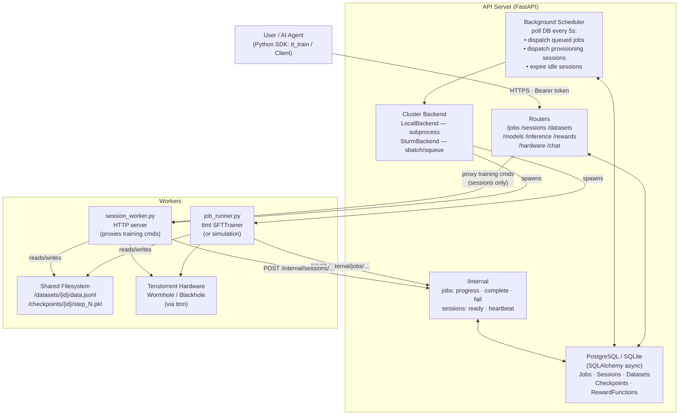
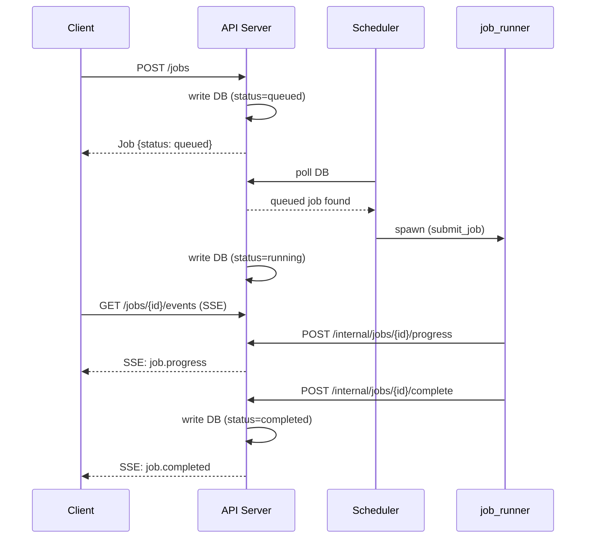
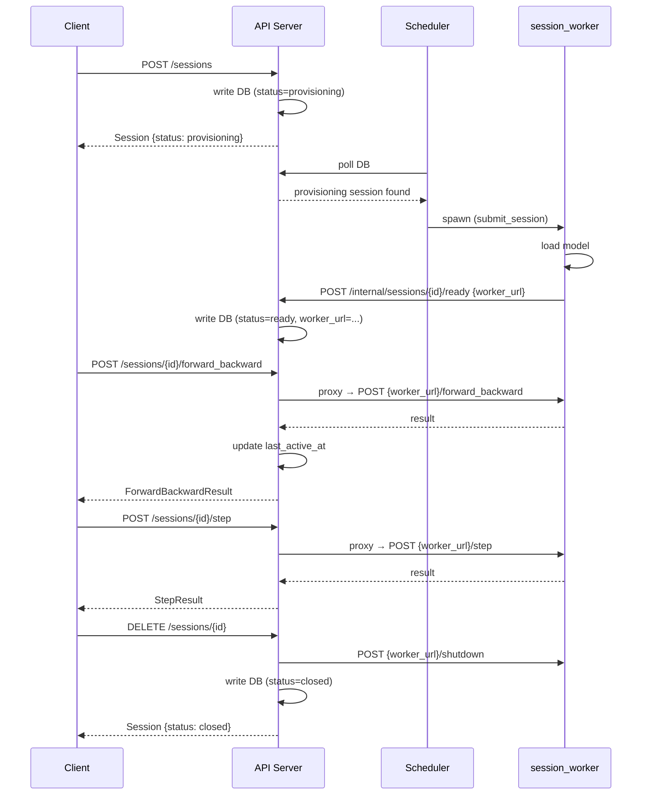

# Technical Architecture

## System Diagram



## Component Descriptions

### SDK (`tt_train/`)

The client library users install. Provides two surfaces:
- **Module-level API** (`tt.jobs.create(...)`) — `_ModuleProxy` objects lazily create a default `Client` from `tt.api_key` or `TT_TRAIN_API_KEY` on first use
- **Explicit `Client`** — preferred for libraries and services; supports context manager

`HTTPClient` (`http.py`) handles all network I/O: Bearer token auth, exponential backoff retries for 429/5xx, SSE streaming via `stream_sse()`, and multipart file upload via `upload()`. Every API response is validated through Pydantic models in `types.py`.

The `Session` object (from `resources/sessions.py`) is a stateful handle that tracks `step_count` locally and proxies training primitives through the server to the session worker.

---

### API Server (`server/`)

FastAPI application. All routes mount under `/v1`. Startup creates DB tables and launches the scheduler task.

**Routers:** jobs, sessions, datasets, models, inference, rewards, hardware, internal
**Database:** SQLAlchemy async (SQLite default, PostgreSQL for production). ORM models in `server/db/models.py`. CRUD helpers in `server/db/crud.py`.
**Auth:** Bearer token via `verify_auth` dependency. User-facing key vs. internal key (used only by workers calling `/internal/*`).

---

### Scheduler (`server/scheduler/service.py`)

Async background loop polling the database every `scheduler_poll_interval` seconds (default 5s). Three operations per tick:

1. **Dispatch queued jobs** — Fetches jobs with `status="queued"`, respects concurrency cap, calls `backend.submit_job()`, marks `status="running"`
2. **Dispatch provisioning sessions** — Fetches sessions with `status="provisioning"`, calls `backend.submit_session()`, waits for worker to self-report ready
3. **Expire idle sessions** — Checks `last_active_at` against `idle_timeout_minutes`; sends shutdown to worker URL, marks `status="expired"`

---

### Cluster Backends (`server/cluster/`)

Abstract interface (`ClusterBackend`) with two implementations:

| Backend | How it runs workers | Concurrency | State |
|---|---|---|---|
| `LocalBackend` | `asyncio.create_subprocess_exec` | Configurable cap (default 1/1) | In-memory `dict[backend_id → Process]` |
| `SlurmBackend` | `sbatch` command | Slurm owns it | Polled via `squeue`; cancel via `scancel` |

Both return a `backend_id` (Slurm job number or `local-N`) stored in the DB. LocalBackend state is lost on server restart.

---

### Workers (`workers/`)

Standalone scripts launched by the scheduler. They run to completion (job_runner) or stay alive until closed (session_worker).

#### `job_runner.py`
Runs a full SFT training job:
1. Parses CLI args (job-id, model, method, training-data, config, storage-path, api-url, api-key)
2. Attempts real training via `ttml.trainers.SFTTrainer` on TT hardware; falls back to simulation if `ttml` is not installed
3. Reports progress to `/v1/internal/jobs/{id}/progress` every 30s via background `ProgressPoller` thread, and at each checkpoint via `TelemetrySFTTrainer` hooks
4. On completion, calls `/v1/internal/jobs/{id}/complete` with result model path and final metrics
5. On failure, calls `/v1/internal/jobs/{id}/fail`

**`TelemetrySFTTrainer`** — Dynamically subclasses ttml's `SFTTrainer` to hook into `_eval()` and `_save_checkpoint()` without modifying the ttml package.

#### `session_worker.py`
Hosts an interactive training session:
1. Loads model into `RealModelState` (or `SimModelState` as fallback)
2. Finds a free port, registers with the API server via `/v1/internal/sessions/{id}/ready`
3. Runs an HTTP server (`http.server.HTTPServer`) accepting POST commands:

| Endpoint | SDK Method | Description |
|---|---|---|
| `/forward_backward` | `session.forward_backward()` | Compute loss, accumulate gradients |
| `/step` | `session.step()` | Apply optimizer, clear gradient buffer |
| `/sample` | `session.sample()` | Generate completions (no grad) |
| `/log_probs` | `session.log_probs()` | Score completions |
| `/eval` | `session.eval()` | Evaluation pass |
| `/save` | `session.save()` | Save checkpoint to shared storage |
| `/shutdown` | `session.close()` / scheduler | Graceful shutdown |

The API server proxies all training primitive requests from client → `session.worker_url` and updates `last_active_at` on each call.

#### `workers/common.py`
`MODEL_CATALOG` maps `tt://catalog/...` URIs to HuggingFace repo IDs and ttml model config paths. `TTML_CONFIG_DIR` points to the ttml config directory under `TT_METAL_HOME`.

---

### Shared Filesystem

Workers and the server exchange data via a shared filesystem path (`TT_TRAIN_SHARED_STORAGE_PATH`, default `/tmp/tt_train_storage`):

```
{storage_path}/
├── datasets/
│   └── {dataset_id}/
│       └── data.jsonl          # JSONL: {"messages": [{role, content}, ...]}
└── checkpoints/
    ├── {job_id}/
    │   ├── ckpts/step_N.pkl    # Written by TelemetrySFTTrainer
    │   └── final               # Result model referenced in /complete callback
    └── {session_id}/
        └── ckpt_{abbrev}_{step:06d}/step_N.pkl   # Written by session.save()
```

---

## Request Flows

### Job Training Flow



### Session Interactive Flow



---

## Configuration

All server config via `pydantic_settings.BaseSettings` with `TT_TRAIN_` prefix. Can also be set in a `.env` file.

| Variable | Default | Description |
|---|---|---|
| `TT_TRAIN_DATABASE_URL` | `sqlite+aiosqlite:///./tt_train.db` | SQLAlchemy async DB URL |
| `TT_TRAIN_CLUSTER_BACKEND` | `local` | `local` or `slurm` |
| `TT_TRAIN_INTERNAL_API_KEY` | `internal-secret` | Workers use this for callbacks |
| `TT_TRAIN_API_BASE_URL` | `http://localhost:8000/v1` | How workers reach the server |
| `TT_TRAIN_WORKER_SCRIPT_DIR` | `/home/boxx/tt-train/workers` | Path to worker scripts |
| `TT_TRAIN_SHARED_STORAGE_PATH` | `/tmp/tt_train_storage` | Dataset and checkpoint storage |
| `TT_TRAIN_SCHEDULER_POLL_INTERVAL` | `5.0` | Scheduler tick interval (seconds) |
| `TT_TRAIN_SESSION_IDLE_TIMEOUT_MINUTES` | `30` | Default idle timeout |
| `TT_TRAIN_LOCAL_MAX_CONCURRENT_JOBS` | `1` | LocalBackend job concurrency cap |
| `TT_TRAIN_LOCAL_MAX_CONCURRENT_SESSIONS` | `1` | LocalBackend session concurrency cap |
| `TT_TRAIN_SLURM_PARTITION` | `None` | Slurm partition name |
| `TT_TRAIN_SLURM_ACCOUNT` | `None` | Slurm billing account |

---

## Known Gaps and Limitations

### Infrastructure
- **LocalBackend state is in-memory** — on server restart, running processes are orphaned and their backend IDs lost
- **No distributed lock on scheduler** — running multiple API instances would double-dispatch jobs
- **Hardcoded log dir** — worker stdout/stderr goes to `/tmp/tt_train_logs` (not configurable)
- **No Alembic migrations** — `create_tables()` at startup works for dev; production needs migrations

### Workers
- **LoRA not applied in RealModelState** — lora config is accepted and stored but the session worker does not actually apply LoRA layers
- **Single-device only** — both workers hardcode `enable_ddp=False, enable_tp=False`; multi-node training not yet wired up
- **Custom loss functions** — only `cross_entropy` is functional in session worker; `dpo`, `ppo`, `reinforce`, `grpo` are API surface only
- **No job resume** — failed jobs cannot restart from last checkpoint

### API / Server
- **Job cost estimation is mocked** — returns random values
- **Inference is mocked** — returns a fixed response; no real model inference yet
- **SSE stream times out** — job event stream polls for ~5 minutes only; long jobs miss tail events
- **Webhooks column exists but is unused**
- **Reward function test scores are random** — no actual execution sandbox yet

### SDK
- **No async client** — fully synchronous; high-concurrency workloads require threading
- **No auto-pagination** — `list()` returns `PaginatedList` with cursor; no helper to iterate all pages
- **Sparse test coverage** — happy path for create/get/upload only; no tests for streaming, retries, most resources
