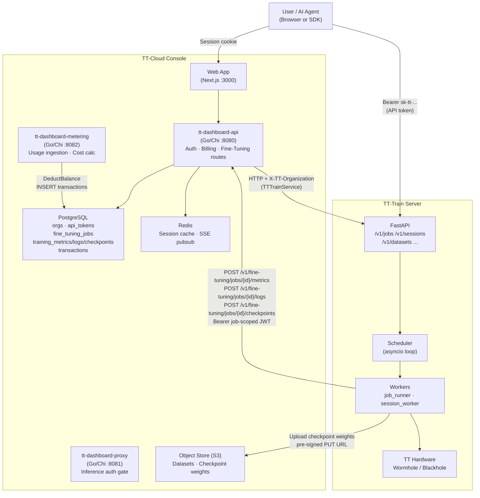
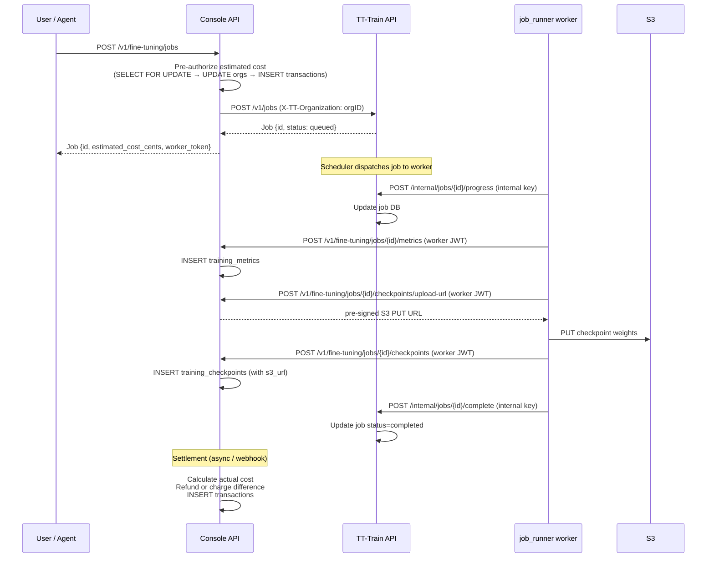

# TT-Train ↔ TT-Cloud Console Integration

## Overview

TT-Train is the training backend for the TT Cloud Console (`tt-cloud-console`). The console handles identity, billing, and the user-facing dashboard; TT-Train handles the actual hardware scheduling and model training. They communicate over HTTP.



---

## Authentication Layers

### 1. User → Console (session cookie)
GitHub OAuth flow. Sessions stored in PostgreSQL, cached in Redis (5-min TTL). Cookie is `HttpOnly; Secure; SameSite=Strict`.

### 2. User/Agent → TT-Train (API token)
Users create `sk-tt-...` API tokens in the console dashboard. The token's `bcrypt` hash is stored in `api_tokens` (console DB). The plaintext is shown once and given to the user to configure in their SDK:
```python
tt.api_key = "sk-tt-abc123..."
```
TT-Train currently accepts any non-empty Bearer token. The intended production flow is for TT-Train to validate the token against the console's `api_tokens` table (or via a validation call to the console API).

### 3. Console → TT-Train (server-to-server, `X-TT-Organization`)
The console's `TTTrainService` forwards requests to TT-Train with the user's `org_id` in the `X-TT-Organization` header. TT-Train uses this to scope all resources (jobs, datasets, sessions) to the org.

### 4. TT-Train Workers → Console (job-scoped JWT)
When the console creates a job via TT-Train, the `CreateJob` response includes a `worker_token` — a short-lived HMAC-SHA256 JWT (7-day TTL) signed with the console's JWT secret. Workers use this token to post metrics, logs, and checkpoints back to the console's worker write endpoints:

```
POST /v1/fine-tuning/jobs/{jobID}/metrics     Bearer <worker_token>
POST /v1/fine-tuning/jobs/{jobID}/logs        Bearer <worker_token>
POST /v1/fine-tuning/jobs/{jobID}/checkpoints Bearer <worker_token>
POST /v1/fine-tuning/jobs/{jobID}/checkpoints/upload-url  Bearer <worker_token>
```

JWT claims:
```go
Claims{
    OrgID:  <org UUID>,
    UserID: <user UUID>,
    JobID:  &<job UUID>,   // non-nil — scopes token to this job only
    // TTL: 7 days
}
```

---

## Fine-Tuning Job Flow



---

## Billing Integration

### Credit Model
All training usage is billed against the org's `credit_balance_cents` in the console's PostgreSQL `orgs` table. The balance is a prepaid credit (topped up via Stripe).

### Pre-Authorization
At job creation, the console atomically:
1. Locks the org row (`SELECT ... FOR UPDATE`)
2. Verifies `balance >= estimated_cost_cents`
3. Deducts `estimated_cost_cents` from the balance
4. Inserts a `finetuning_usage` transaction (negative amount)

This prevents overspend when multiple jobs are submitted concurrently.

### Cost Calculation
Fine-tuning cost is CPU-time based, using the `model_pricing` table:
```
cost_cents = cpu_price_per_sec (microcents) × actual_gpu_seconds / 1,000,000
             (ceiling division: round up to nearest cent)
```
The `model_pricing` table has a `cpu_price_per_sec` column (nullable; only set for models that support fine-tuning). All arithmetic uses integer microcents — no floating point.

### Settlement
After job completion (or failure/cancellation):
- **Completed:** Actual cost calculated from `started_at` to `completed_at`. The difference between estimated and actual is refunded or additionally charged.
- **Failed:** Full pre-authorized amount refunded.
- **Cancelled before running:** Full refund. Cancelled during run: charged for actual runtime.

### Metering Event Pipeline
Workers emit usage events via the `EventPublisher` interface:
- `finetuning.training_step` — emitted per checkpoint, carries `training_tokens` and `gpu_seconds`
- `finetuning.job_completed` — emitted at job completion, carries totals for audit

Events are POSTed to `tt-dashboard-metering` at `POST /v1/events` with a signed JWT. The metering service calls `billing.DeductBalance()` which atomically deducts from `orgs.credit_balance_cents` and inserts a `transactions` row.

### Transaction Record Shape
```sql
-- Example fine-tuning deduction
INSERT INTO transactions (org_id, type, amount_cents, balance_after_cents, description, reference_id)
VALUES ($org_id, 'finetuning_usage', -$cost, $new_balance, 'Fine-tuning job: <job_id>', $job_id);
```

---

## Storage Integration

### Datasets
Datasets are stored in S3. The console's `datasets` table tracks metadata (`org_id`, `s3_key`, `format`, `status`, `row_count`). The TT-Train server currently stores datasets on local filesystem; production flow is for TT-Train to read datasets from S3 via the `s3_key`.

### Checkpoints
Workers upload checkpoint weights directly to S3 using pre-signed PUT URLs:
1. Worker calls `POST /v1/fine-tuning/jobs/{id}/checkpoints/upload-url` (JWT auth) to get a pre-signed URL
2. Worker PUTs the `.pkl`/safetensors file to the pre-signed URL
3. Worker calls `POST /v1/fine-tuning/jobs/{id}/checkpoints` to record metadata (step, loss, `s3_url`, `size_bytes`, `ckpt_type`)

Users download via pre-signed GET URL from `GET /v1/fine-tuning/jobs/{id}/checkpoints/{ckptID}/download-url`.

S3 key layout: `checkpoints/{orgID}/{jobID}/{filename}`

---

## Console Database Schema (Fine-Tuning Relevant Tables)

```
fine_tuning_jobs          Jobs submitted from the console (mirrors TT-Train job state)
  id, org_id, created_by_user_id
  status                  queued | running | completed | failed | cancelled
  model, dataset_url, optimizer, training_params (JSONB), cluster_size
  estimated_cost_cents, actual_cost_cents
  tt_cloud_workload_id    (reserved, for future TT-Cloud direct integration)
  temporal_workflow_id    (reserved, for Temporal workflow)
  error_message, started_at, completed_at

training_metrics          One row per (job_id, step) — PRIMARY KEY (job_id, step)
  job_id → fine_tuning_jobs.id (UUID FK, CASCADE DELETE)
  org_id, step, epoch, train_loss, val_loss, grad_norm, learning_rate, tokens_per_second

training_logs             One row per log event
  id (UUID PK), job_id → fine_tuning_jobs.id (UUID FK, CASCADE DELETE)
  org_id, step (nullable), log_type (info|warning|error|checkpoint|eval), message, logged_at

training_checkpoints      One row per saved checkpoint — UNIQUE (job_id, step)
  id (UUID PK), job_id → fine_tuning_jobs.id (UUID FK, CASCADE DELETE)
  org_id, step, epoch, train_loss, val_loss
  s3_url (nullable — set when worker uploads weights)
  size_bytes, ckpt_type (full | lora | adapter)

datasets                  User-uploaded training datasets
  id (UUID PK), org_id, created_by_user_id
  name, s3_key, format (jsonl|parquet|csv), file_size_bytes, row_count
  status (pending|ready|failed), validation_error
```

All tables have RLS enabled: `org_id = current_setting('app.current_org_id')::uuid`.

---

## Console API Endpoints (Fine-Tuning)

### User-Facing (session cookie auth)

| Method | Path | Roles | Description |
|---|---|---|---|
| `GET` | `/v1/fine-tuning/jobs` | all | List jobs for current org |
| `POST` | `/v1/fine-tuning/jobs` | owner, developer | Create job (pre-auth cost, forward to TT-Train) |
| `GET` | `/v1/fine-tuning/jobs/{id}` | all | Get job detail |
| `POST` | `/v1/fine-tuning/jobs/{id}/cancel` | owner, developer | Cancel job |
| `GET` | `/v1/fine-tuning/jobs/{id}/metrics` | all | Training metrics timeseries |
| `GET` | `/v1/fine-tuning/jobs/{id}/logs` | all | Training log entries |
| `GET` | `/v1/fine-tuning/jobs/{id}/checkpoints` | all | Saved checkpoints |
| `GET` | `/v1/fine-tuning/jobs/{id}/checkpoints/{ckptID}/download-url` | all | Pre-signed download URL |
| `GET` | `/v1/fine-tuning/jobs/{id}/model/download-url` | all | Final model download (not yet implemented) |

### Worker Write (job-scoped Bearer JWT auth)

| Method | Path | Description |
|---|---|---|
| `POST` | `/v1/fine-tuning/jobs/{id}/metrics` | Record a training step metric |
| `POST` | `/v1/fine-tuning/jobs/{id}/logs` | Append a log entry |
| `POST` | `/v1/fine-tuning/jobs/{id}/checkpoints` | Record checkpoint metadata |
| `POST` | `/v1/fine-tuning/jobs/{id}/checkpoints/upload-url` | Get pre-signed S3 PUT URL |

---

## Service Implementations

The console's `finetuning.Service` interface has three implementations:

| Implementation | Used When | Description |
|---|---|---|
| `TTTrainService` | `TT_TRAIN_BASE_URL` is set | Forwards all calls to the TT-Train server over HTTP |
| `DBService` | DB available, TT_TRAIN_BASE_URL not set | Direct PostgreSQL — jobs run as demo simulations |
| `DemoService` | Demo mode | In-memory, no DB required |

`TTTrainService` is the production path. It forwards `X-TT-Organization` on every request.

---

## SSE Real-Time Updates

Job status changes flow to connected browser clients via Server-Sent Events:

1. TT-Train worker posts progress/completion to TT-Train's `/internal/` endpoints
2. TT-Train updates its DB and (future) publishes to Redis channel `sse:org:{org_id}`
3. Console SSE handler subscribes to Redis and forwards events to the browser

Frontend subscribes at: `GET /v1/sse?stream=fine-tuning-jobs`

Events trigger TanStack Query cache invalidation, causing the UI to refetch fresh data.

---

## Key Configuration

| Console env var | Description |
|---|---|
| `TT_TRAIN_BASE_URL` | URL of TT-Train server (e.g. `http://tt-train:8000`). Activates `TTTrainService`. |
| `JWT_SECRET` | Shared HMAC-SHA256 secret for signing worker JWTs (must be ≥32 chars) |
| `METERING_URL` | URL of metering service for billing event publication |
| `S3_BUCKET` / `S3_ENDPOINT` / AWS credentials | Object storage for datasets and checkpoints |

| TT-Train env var | Description |
|---|---|
| `TT_TRAIN_API_KEY` | Accepted Bearer token for SDK clients (set to match console-issued `sk-tt-...` tokens) |
| `TT_TRAIN_INTERNAL_API_KEY` | Used by workers to call `/internal/*` callbacks |

---

## Current Gaps (Integration Perspective)

- **TT-Train doesn't validate API tokens against the console DB** — it accepts any non-empty Bearer token. Production needs token validation against `api_tokens` (via shared DB or a validation endpoint on the console API).
- **TT-Train workers use the internal callback pattern** (`/internal/jobs/progress`) rather than the console's new worker write endpoints (JWT-authenticated `/v1/fine-tuning/jobs/{id}/metrics`). These need to be unified.
- **No billing signal from TT-Train workers** — workers don't currently call the `EventPublisher`. The `finetuning.training_step` events are not yet emitted from actual training runs.
- **Dataset storage is local filesystem** in TT-Train; production needs S3 integration with the console's `datasets` table.
- **No SSE bridge** — TT-Train's job progress events don't currently flow to the console's Redis pub/sub for real-time UI updates.
