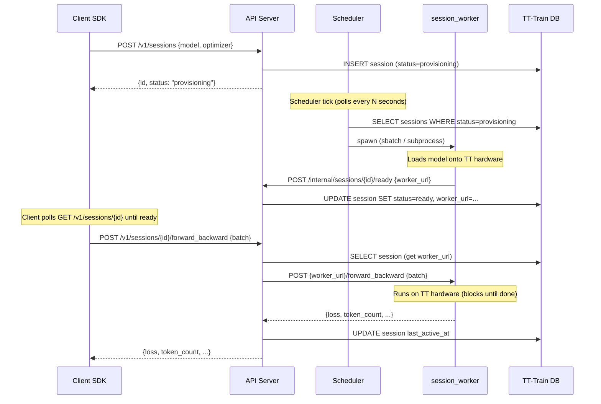

# TT-Train Service Design

**Status:** Design spec — captures current state and what needs to change
**Scope:** Deployment, worker lifecycle, client-worker communication, database responsibilities, service contract

---

## Service Contract: What TT-Train Exposes

TT-Train is a service. It has two consumer groups with different needs:

- **TT-Cloud-Console** (`TTTrainService`) — server-to-server, passes `X-TT-Organization` header
- **SDK users / AI agents** — direct Python SDK, Bearer token auth

These overlap heavily, but some endpoints are only relevant to one consumer. The contract must be explicit.

### Console-Facing Endpoints (the service interface)

These are the endpoints the console calls. They form the stable API contract between the two systems.

```
POST   /v1/jobs                      Create a fine-tuning job
GET    /v1/jobs/{id}                 Get job status and result
POST   /v1/jobs/{id}/cancel          Cancel a running or queued job
GET    /v1/jobs/{id}/estimate        Estimate cost before submitting

POST   /v1/sessions                  Provision an interactive session
GET    /v1/sessions/{id}             Get session status
DELETE /v1/sessions/{id}             Close and terminate session
POST   /v1/sessions/{id}/forward_backward
POST   /v1/sessions/{id}/step
POST   /v1/sessions/{id}/sample
POST   /v1/sessions/{id}/log_probs
POST   /v1/sessions/{id}/eval
POST   /v1/sessions/{id}/save

GET    /v1/hardware                  Hardware availability
GET    /v1/models                    Model catalog
```

#### Job creation request (console → TT-Train)

When the console creates a job, it must pass additional fields so TT-Train workers can call back correctly:

```json
POST /v1/jobs
{
  "console_job_id":   "uuid",          // console's canonical ID — stored, used in all callbacks
  "model":            "tt://catalog/llama-3.2-8b",
  "dataset_url":      "https://...",   // pre-signed S3 download URL (not a local dataset ID)
  "method":           "sft",
  "config":           { "max_steps": 1000, "lr": 2e-5 },
  "console_base_url": "https://console.api/",  // for worker callbacks
  "worker_token":     "eyJ...",        // job-scoped JWT issued by console
  "callback_url":     "https://console.api/internal/fine-tuning/callback"  // SSE bridge
}
```

This aligns with the interface decisions in `architecture-review.md`.

### Internal Endpoints (worker → API server)

Not callable by SDK clients or the console. Authenticated with `TT_TRAIN_INTERNAL_API_KEY`.

```
POST /v1/internal/jobs/{id}/progress        Worker step progress
POST /v1/internal/jobs/{id}/complete        Job finished successfully
POST /v1/internal/jobs/{id}/fail            Job failed

POST /v1/internal/sessions/{id}/ready       Worker registered its URL
```

### SDK-Only Endpoints (direct use, no console)

Used when the SDK talks to TT-Train directly without going through the console.

```
POST   /v1/datasets                  Upload a dataset (multipart)
GET    /v1/datasets/{id}
DELETE /v1/datasets/{id}
POST   /v1/datasets/{id}/validate

GET    /v1/models/{id}/checkpoints
POST   /v1/models/{id}/checkpoints/download-url

POST   /v1/rewards                   Register reward function
POST   /v1/rewards/{id}/test

POST   /v1/inference/generate
POST   /v1/inference/batch
POST   /v1/inference/chat/completions
```

---

## Worker Lifecycle

### Session Worker



**The client-worker connection is a synchronous HTTP proxy.** The client's HTTP request to the API server is held open while the API server makes a downstream HTTP request to the worker. The client is blocked for the duration of the computation. The worker's embedded HTTP server is single-threaded by design — only one command at a time, which preserves gradient state correctness.

Key properties:
- Worker's HTTP server (`http.server.HTTPServer`) handles exactly one request at a time. Concurrent calls to the same session will queue at the TCP level.
- Timeout is 300s. For long eval passes or large-batch sampling, this may need to be raised or made configurable per-endpoint.
- If the API server process restarts mid-computation, the client receives an error, but the worker continues running. The client can reconnect and issue the next command — the worker's in-memory model state is preserved.

### Job Runner

Job runner workers don't need a bidirectional connection. They run autonomously:

1. Scheduler submits job → worker starts
2. Worker calls `POST /internal/jobs/{id}/progress` periodically (every 30s + at each checkpoint)
3. Worker calls `POST /internal/jobs/{id}/complete` or `.../fail` when done
4. API server relays status to the console callback URL

No long-lived connection from the server side to the job worker.

---

## Deployment

### Docker Images

Two images (or one image with different entrypoints):

**`tt-train-server`** — the FastAPI API server + scheduler

```dockerfile
FROM python:3.11-slim
WORKDIR /app
COPY . .
RUN pip install -e ".[server]"
CMD ["uvicorn", "server.main:app", "--host", "0.0.0.0", "--port", "8000"]
```

**`tt-train-worker`** — job runner and session worker processes

```dockerfile
FROM python:3.11-slim
# On TT hardware nodes: add ttml/ttnn deps
WORKDIR /app
COPY . .
RUN pip install -e "."
# Entrypoint determined by CMD override at launch:
# docker run tt-train-worker python workers/job_runner.py --job-id ...
# docker run tt-train-worker python workers/session_worker.py --session-id ...
```

In practice, if the API server and workers run on the same machine (LocalBackend), a single image works. For Slurm or Kubernetes, the worker image is deployed separately to the compute nodes.

### docker-compose (local development)

```yaml
services:
  db:
    image: postgres:16
    environment:
      POSTGRES_DB: tt_train
      POSTGRES_USER: tt_train
      POSTGRES_PASSWORD: tt_train
    volumes:
      - pgdata:/var/lib/postgresql/data

  server:
    build:
      context: .
      dockerfile: Dockerfile.server
    ports:
      - "8000:8000"
    environment:
      DATABASE_URL: postgresql+asyncpg://tt_train:tt_train@db/tt_train
      TT_TRAIN_INTERNAL_API_KEY: dev-internal-key
      TT_TRAIN_API_KEY: dev-api-key
      CLUSTER_BACKEND: local
      API_BASE_URL: http://server:8000
      SHARED_STORAGE_PATH: /data
    volumes:
      - ./:/app
      - shared_storage:/data
    depends_on:
      - db

volumes:
  pgdata:
  shared_storage:
```

Workers launched by LocalBackend inherit the server's environment. For the LocalBackend case, the server and workers share the host filesystem — no separate worker service entry is needed in docker-compose.

### Slurm Deployment

Slurm introduces two requirements that the current `SlurmBackend` does not satisfy:

**1. Proper sbatch script generation**

`sbatch` expects a shell script with `#!/bin/bash` and `#SBATCH` directives, not a raw Python file invocation. The current `_build_sbatch_cmd` passes the Python script path directly as the final argument to `sbatch`, which means Slurm would try to execute `job_runner.py` as a shell script.

What the SlurmBackend must generate:

```bash
#!/bin/bash
#SBATCH --job-name=tt-job-{job_id}
#SBATCH --nodes=1
#SBATCH --output=/shared/logs/job_{job_id}.out
#SBATCH --error=/shared/logs/job_{job_id}.err
#SBATCH --partition=gpu-tt
#SBATCH --account=tenstorrent

source /shared/tt-train/venv/bin/activate
export PYTHONPATH=/shared/tt-train:$PYTHONPATH

python /shared/tt-train/workers/job_runner.py \
  --job-id {job_id} \
  --api-url http://tt-train-api:8000 \
  ...
```

The `SlurmBackend` should write this file to a temp directory and pass it to `sbatch`, then clean it up after submission.

**2. Worker-to-API-server network reachability**

On Slurm clusters, compute nodes often live on an internal network (e.g., `node001.cluster.local`). The session worker registers its URL using `socket.gethostname()`, which resolves to the compute node hostname. The API server must be able to reach this address.

Deployment options:
- **API server inside the cluster** (login/head node): compute node hostnames resolve → worker URL is reachable directly. This is the simplest model.
- **API server outside the cluster**: compute nodes are not reachable. Requires either:
  - An internal reverse proxy (nginx on the head node) that the compute nodes can push their registration to, or
  - A message queue (Redis pub/sub) where workers push commands/results instead of hosting an HTTP server
  - Port forwarding via SSH tunnel (not practical at scale)

For now, the expected deployment is **API server on the Slurm head/login node** with the TT hardware compute nodes being network-reachable from it.

### Kubernetes (future)

Kubernetes is the natural evolution of LocalBackend. Instead of `asyncio.create_subprocess_exec`, the backend submits a `batch/v1 Job` object. The `worker_url` registration pattern works unchanged because k8s pod IPs are routable within the cluster. A `KubernetesBackend` would implement the same `ClusterBackend` interface as Local and Slurm.

---

## Database Responsibilities

Two databases exist: TT-Train's (SQLite/PostgreSQL) and the Console's (PostgreSQL). The line between them must be explicit.

### TT-Train DB owns: execution state

| Table | Purpose | Key columns |
|---|---|---|
| `jobs` | Scheduler state | `status`, `backend_id` (slurm job id), `console_job_id`, `started_at` |
| `sessions` | Worker location + lifecycle | `status`, `worker_url`, `last_active_at`, `slurm_job_id` |
| `datasets` | Local-only uploads (SDK direct path) | `id`, `path`, `format`, `row_count` |
| `checkpoints` | Local checkpoint index (SDK direct path) | `id`, `model_path`, `step`, `session_id` |

TT-Train's DB is **not** the source of truth for billing, metrics, logs, or anything the user sees in the console UI. It is an operational scratchpad for the scheduler and proxy layer.

When running via the console: `console_job_id` is stored on the `jobs` row as the correlation key. All metric/log/checkpoint writes go to the console via worker JWT callbacks; TT-Train's DB does not receive them.

When running via the SDK directly (no console): TT-Train's DB stores whatever is needed for the SDK to function (checkpoints, dataset metadata). The console is not involved.

### Console DB owns: platform state

Everything in `fine_tuning_jobs`, `training_metrics`, `training_logs`, `training_checkpoints`, `datasets` (S3-backed) stays in the console. See `cloud-console-integration.md` for the full schema.

### The overlap problem (current state)

The current TT-Train DB schema has more columns than needed for pure execution state — it stores model names, full training configs, optimizer settings, and checkpoint metadata in a way that duplicates what the console tracks. This is acceptable for the SDK-direct path but creates confusion when both the console path and the SDK path are active simultaneously.

The practical fix: keep the current schema but treat it as serving two modes:
- **Console mode**: `jobs` row has `console_job_id` set; worker callbacks go to the console; TT-Train DB used only for scheduler state
- **Direct SDK mode**: `jobs` row has no `console_job_id`; everything stays local

The scheduler and proxy layer don't need to know which mode they're in — workers do.

---

## What Needs to Change

Prioritized by impact:

### 1. Slurm backend: generate proper sbatch scripts

`SlurmBackend._build_sbatch_cmd` needs to write a shell script to disk and `sbatch` that file, not pass the Python script as a positional argument. Must include:
- `#!/bin/bash` + `#SBATCH` directives
- `source venv/bin/activate` (path from config)
- `PYTHONPATH` export
- Configurable via new settings: `SLURM_VENV_PATH`, `SLURM_SCRIPT_TMPDIR`

### 2. Docker: Dockerfile + docker-compose

- `Dockerfile.server` for the API server
- `Dockerfile.worker` (or shared) for workers
- `docker-compose.yml` for local dev (server + postgres + shared storage volume)

### 3. Worker timeout: make it configurable per-endpoint

`_proxy_to_worker()` uses a hard-coded `timeout=300.0`. Add per-endpoint timeouts in config:

| Endpoint | Default timeout |
|---|---|
| `forward_backward` | 300s |
| `step` | 60s |
| `sample` | 600s (can generate many tokens) |
| `eval` | 600s |
| `save` | 120s |

### 4. Service contract: console job creation fields

`POST /v1/jobs` currently accepts only `model`, `training_data`, `method`, `config`. Needs:
- `console_job_id` (optional — omit for SDK direct path)
- `dataset_url` (replaces `training_data` for console path — a download URL, not a local dataset ID)
- `console_base_url` + `worker_token` forwarded to job runner
- `callback_url` for SSE bridge

These follow the migration phases in `architecture-review.md`.

### 5. Slurm network reachability: document the constraint

Add explicit config validation: if `CLUSTER_BACKEND=slurm`, require `API_BASE_URL` to be set to an address reachable from compute nodes. Log a warning if it looks like `localhost`.
